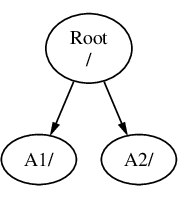
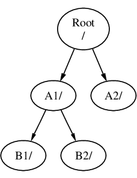
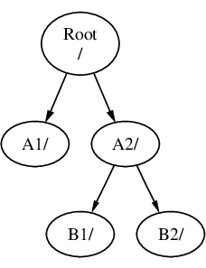
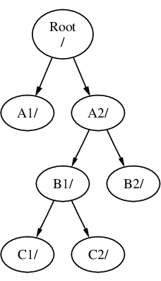
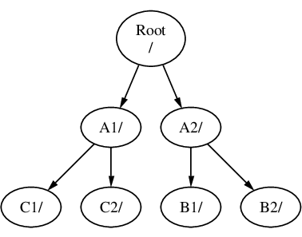

# 第 2 节  FreeBSD 基础

::: tip 提示
本节内容面向从未接触过 FreeBSD 或 Linux 系统的使用者。如果你用过 Linux，可以跳过本节。
:::

这里是一些使用 FreeBSD 的基础知识。事实上对于其他 UNIX-like 系统，这些内容都很相近，但略有区别。你可以随时回来浏览这一节。

## 控制台，终端和登陆

安装了 FreeBSD 后如何使用？FreeBSD 的基本安装并不带有图形用户界面，因此你只能看到满屏的文本。要想正常使用系统首先你要在终端登陆。

下面是[FreeBSD 简体中文手册 3.2.控制台和终端](https://handbook.bsdcn.org/di-3-zhang-freebsd-ji-chu/3.2.-xu-ni-kong-zhi-tai-he-zhong-duan)的引用：（[英文原版：FreeBSD Handbook 3.2. Virtual Consoles and Terminals](https://docs.freebsd.org/en/books/handbook/basics/#consoles)）

> 如果 FreeBSD 没有在启动时配置自动启动图形环境，系统将启动到一个命令行登录提示符，如下所示：
>
> ```text
> FreeBSD/amd64 (pc3.example.org) (ttyv0)
>
> login:
> ```
>
> 第一行包含了一些关于系统的信息。`amd64`表示此示例系统正在运行 FreeBSD 的 64 位版本。主机名为`pc3.example.org`，`ttyv0`表示这是"系统控制>台"。第二行是登录提示符。
>
> 由于 FreeBSD 是一个多用户系统，它需要一种区分不同用户的方式。这是通过要求每个用户在访问系统上的程序之前登录系统来实现的。每个用户都有一个唯一的“username”和个人“password”。
>
> 要登录到系统控制台，请输入在系统安装期间配置的用户名（如[添加用户](https://docs.freebsd.org/en/books/handbook/book/#bsdinstall-addusers)中所述）并按回车键。然后输入与用户名关联的密码并按回车键。出于安全原因，密码不会被回显。
>
> 输入正确的密码后，将显示今日消息（MOTD），后跟命令提示符。根据创建用户时选择的 shell，此提示符将是`#`，`$`或`%`字符之一。提示符表示用户现在已登录到 FreeBSD 系统控制台，并准备尝试可用的命令。

感兴趣的话你也可以看看全文，简单理解 `控制台（console）` 和 `终端（terminal）` 的区别。这是 FreeBSD 相较于 Linux 的有差别的点。

## FreeBSD 目录结构

当你安装完 FreeBSD，或其他 UNIX-like（比如 Linux，事实上包括 MacOS，但是略有不同）系统，你会注意到这 “看起来有点不一样” ~~（没有桌面只有命令行一片乌漆嘛黑当然不一样，但我指的是目录结构上）~~ 。UNIX-like 系统不像 Windows 那样使用不同的盘符来区分文件（比如系统 C:，文档 D:，可能还有更多）。UNIX-like 很多情况下只有一个分区，被 [挂载](#硬盘分区与挂载) 到 `/`。这个 `/` 被叫做 “根目录”。可以理解为如果 Windows 中只有一个 `C:` 盘，这就是你打开 `C:` 盘所在的位置。这是所有文件和目录的起始位置。也就是说，所有文件的路径都从 `/` 开始，就像只有 `C:` 盘的 Windows 中所有文件都从 `C:\` 开始一样。

如果你在 FreeBSD（后文如果未加说明，所有命令均为在 FreeBSD 14.0-RELEASE 执行）执行 `ls /`（这条命令的含义是列出 `/` 下的所有文件和文件夹，稍后也会解释），你应该会看到一个列表：

```shellsession
alex11@freebsd:~ $ ls /
COPYRIGHT    dev          home         media        proc         sbin         usr
bin          entropy      lib          mnt          rescue       sys          var
boot         etc          libexec      net          root         tmp          zroot
```

粗略讲解比较重要的部分：

| 内容 | 作用 |
| --- | --- |
| `/bin/` | 即 Binary，存放部分可执行文件，通常这里的程序是不可或缺的 |
| `/boot/` | 存放与系统启动有关的文件 |
| `/dev/` | 即 Device，硬件设备所在的文件夹。 |
| `/etc/` | 即 Etcetera，存放系统级配置文件和脚本 |
| `/home/` | “家目录”，与 Windows 的 `C:\Users` 类似 |
| `/lib/` | 即 Library，存放部分库文件（Windows 中的 dll），通常是不可或缺的 |
| `/libexec/` | 通常存放一些不可或缺的，但不应该由用户直接主动执行的程序 |
| `/media/` | 通常用来挂载 U 盘，USB 光驱等外置移动存储设备 |
| `/mnt/` | 即 Mount，通常用来挂载内置的硬盘等固定存储设备 |
| `/root/` | `root` 用户的家目录，见 [root 用户](#root-用户) |
| `/sbin/` | 即 Superuser Binary，类似 `/bin/`，存放不可或缺的系统管理程序 |
| `/tmp/` | 即 Temporary，存放临时文件，重启后会清除 |
| `/usr/` | 即 UNIX System Resource，顾名思义，系统所用的资源文件 |
| `/var/` | 即 Variable，在系统使用过程中会不断变化的文件，比如日志文件 |

除了在根目录的这些文件夹，还有一些文件夹值得注意：

`/usr/bin/` `/usr/sbin/` `/usr/lib/` `/usr/libexec/`：你会发现这些文件夹很眼熟。事实上他们的作用与在根目录下的类似。可以这样粗略的理解：根目录下的是系统正常运行使用必不可少的，而 `/usr/` 下的是“可选”的，删除他们只会影响某些功能而不影响基本的系统运行使用。即便如此，也绝对不应该轻易删除这里的文件，因为这些内容包含系统的其他重要功能。比如在 Windows 中，如果你删掉了设置应用，那你可能还能正常使用，但也丢失了系统的重要功能。如果装了一些软件包，`/usr/local/` 下也会有类似的布局。这里装的是基本系统以外的，后安装的文件，可以安全移除，但也不要手动移除，应该用包管理器。

`/usr/ports/`：这是 FreeBSD 的 ports 树所在的文件夹。

`/usr/src/`：这是 FreeBSD 的源代码所在的文件夹。

### 家目录

家目录一般为 `/home/username/`。例如：用户名为 `alex11`，则家目录为 `/home/alex11/`。家目录可简写为 `~`。例如，`/home/alex11/.xprofile` （这是桌面的环境变量配置文件）可以简写为 `~/.xprofile`。

不用着急把这一切都记住，只需要混个脸熟。以后我们可能会多次涉及到某个文件夹，到时再加深印象也不迟。

更多的信息可以看 [FreeBSD Handbook 3.5.Directory Structure](https://docs.freebsd.org/en/books/handbook/basics/#dirstructure)（[翻译：FreeBSD 简体中文手册 3.5.目录结构](https://handbook.bsdcn.org/di-3-zhang-freebsd-ji-chu/3.5.-mu-lu-jie-gou)）和手册 [hier(7)](https://man.freebsd.org/cgi/man.cgi?query=hier&sektion=7&format=html)

## 硬盘分区与挂载

[FreeBSD Handbook 3.6. Disk Organization](https://man.freebsd.org/cgi/man.cgi?query=hier&sektion=7&format=html)（[翻译：FreeBSD 简体中文手册 3.6.磁盘结构](https://handbook.bsdcn.org/di-3-zhang-freebsd-ji-chu/3.6.-ci-pan-jie-gou)）解释的很充分。下面引用和解释 [FreeBSD 简体中文手册 3.6.磁盘结构](https://handbook.bsdcn.org/di-3-zhang-freebsd-ji-chu/3.6.-ci-pan-jie-gou)的部分内容：

> 考虑三个文件系统，称为`A`、`B`和`C`。每个文件系统都有一个根目录，其中包含两个其他目录，称为`A1`、`A2`（以及类似地`B1`、`B2`和`C1`、`C2`）。

指你的硬盘有三个分区，如果在 Windows 下很可能就是 `C:` `D:` `E:`。那在 FreeBSD 下呢？

> 将`A`称为根文件系统。如果使用 [ls(1)](https://man.freebsd.org/cgi/man.cgi?query=ls&sektion=1&format=html) 查看此目录的内容，它将显示两个子目录，`A1`和`A2`。目录树如下：
>
> 
>
> 一个文件系统必须以目录形式被挂载到另一个文件系统上。当把文件系统 `B` 挂载到 `A1` 的目录上时，`B` 的根目录变成了 `A1`，`B` 中的目录也相应地发生改变：
>
> 
>
> 任何位于 `B1` 或 `B2` 目录下的文件都必须经过路径 **/A1/B1** 或 **/A1/B2** 才能到达。任何在 `/A1` 中原有的文件都被暂时隐藏了。如果把 `B` 从 `A` 上 _卸载_ 下来，它们将重新出现。
>
> 如果 `B` 被挂载在 `A2` 上，那么图片会是这样的：
>
> 
>
> 而路径将分别为 **/A2/B1** 和 **/A2/B2**。
>
> 文件系统可以被挂载在其他文件的之上。继续上一个例子，文件系统 `C` 可以挂载在文件系统 `B` 的 B1 目录之上，从而形成这种安排：
>
> 
>
> 或者可以直接挂载 `C` 到文件系统 `A` 的 `A1` 目录下：
>
> 

懂了吗？在 FreeBSD 下不存在盘符，整体结构就像树枝分叉一样。一个目录就有可能是另一个硬盘分区，甚至是另一块物理硬盘，就像一棵树上可以嫁接另一棵树的树枝一样。没懂也没关系，~~用多了就懂了~~。

## `root` 用户

在各种教程中，经常会提示你某命令要用 `root` 用户执行。`root` 用户是 UNIX-like 系统中自带的，权限极大的用户，大于 Windows 中的 `Administrator` 用户，在某些意义上甚至大于 `System` 用户。他的权限大到可以把一个运行中的系统整个删除，经典的 `rm -rf /` 笑话（**不要尝试这条命令！**~~除非你真的想删掉整个系统~~）。但是几乎所有涉及到系统的命令都要以 `root` 用户执行，所以使用 `root` 用户时要小心谨慎。在基本的 FreeBSD 系统中，你可以用 `su` 命令切换到 `root` 用户：

```shellsession
alex11@freebsd:~ $ su - root
Password:
root@freebsd:~ #
```

可以看到，用户名从 `alex11` 变成了 `root`，提示符也从 `$` 变为了 `#`。**用完不要忘了用 `exit` 命令退出 `root` 用户！**

## 常用命令简介

### `cd`

进入某个目录的命令。例如 `cd /usr` 可以进入 `/usr/` 目录。`.` 表示当前目录。`..` 表示上一级目录。例如如果当前目录为 `/usr/local/`，则 `cd ..` 会进入 `/usr/`。

### `ls`

列出当前目录包含的文件。`ls -a` 可以列出所有文件，包括以 `.` 开头的文件。在 FreeBSD 中，文件或文件夹名称以 `.` 开头表示隐藏文件或文件夹。

### `cp` 和 `mv`

`cp` 即 “Copy”，复制文件。`mv` 即 “Move”，移动（剪切）文件。用法为 `cp/mv source target`。使用 `cp -R dir` 可以递归复制整个目录。有意思的是文件重命名也是用 `mv` 命令实现的，即把文件剪切掉再用另外一个名字粘贴回来，例如 `mv file file1`。

### `rm` 和 `rmdir`

`rm` 即 “Remove”，删除文件。例如 `rm file`。使用 `rm -r dir` 递归删除目录。使用 `rm -f file` 强行且不提示的删除某些被保护的文件。`rm -r` 和 `rm -f` 可以合写为 `rm -rf`。由于 `rm` 不带有回收站机制，使用的时候要尤其小心。

`rmdir` 仅用于删除目录，且一般只用于删除空目录。

### `ee`

FreeBSD 自带的文本编辑器。使用 `ee file` 编辑文件。快捷键都在上方列出。按 `esc` 进入菜单，再按两次回车可以保存退出。

### `su`

即 “Switch User”，切换用户。如果你已经是 `root` 用户而想切换到其他用户，则不需要输入密码。如果是在普通用户之间切换或切换到 `root` 用户，则需要输入目标用户的密码。密码不会显示。用 `exit` 命令可以退出切换到的用户回到之前的用户。

### `sudo` 和 `doas`

可以临时切换成 `root` 用户执行某个命令。很多教程让你执行的命令都以 `sudo` 开头，实际上意味着后面的命令要以 `root` 身份执行。`doas` 是 `sudo` 的一个轻量化和可能更安全的替代。这两个命令不包含在基本系统，需要手动安装。
