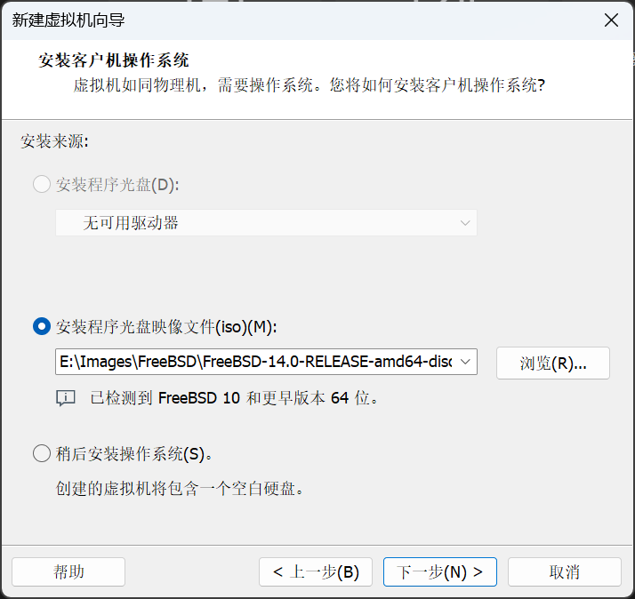
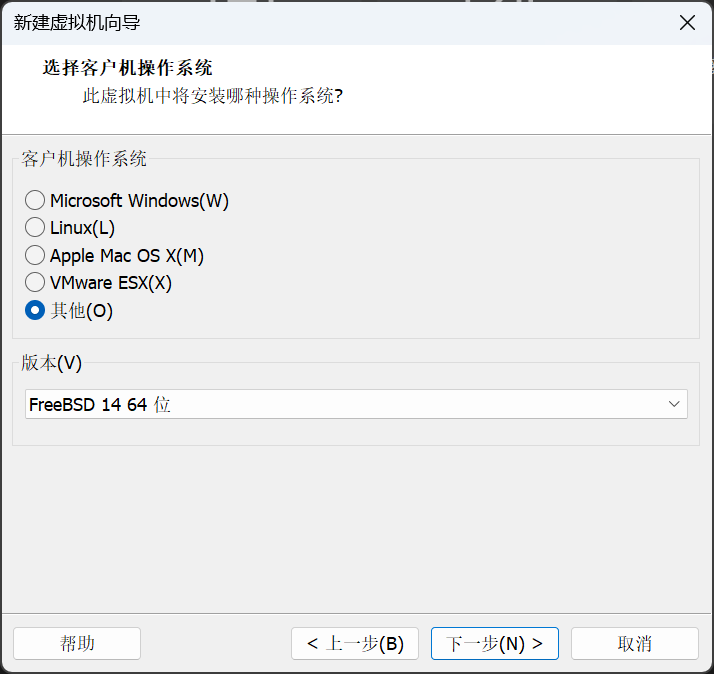
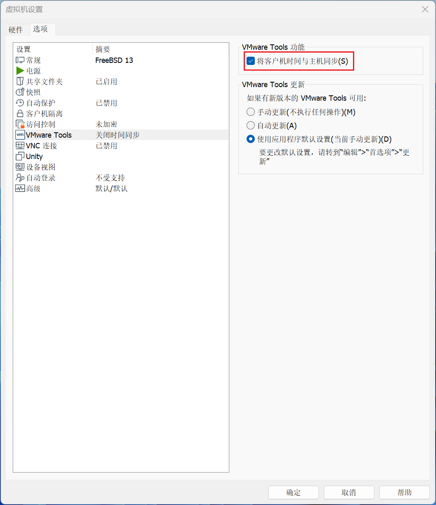
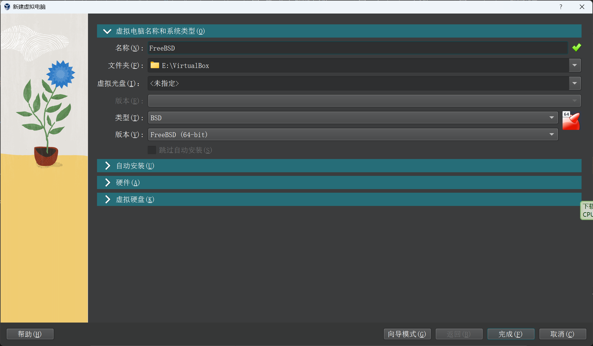
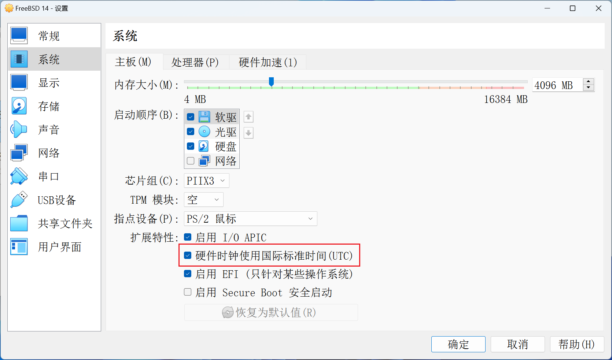
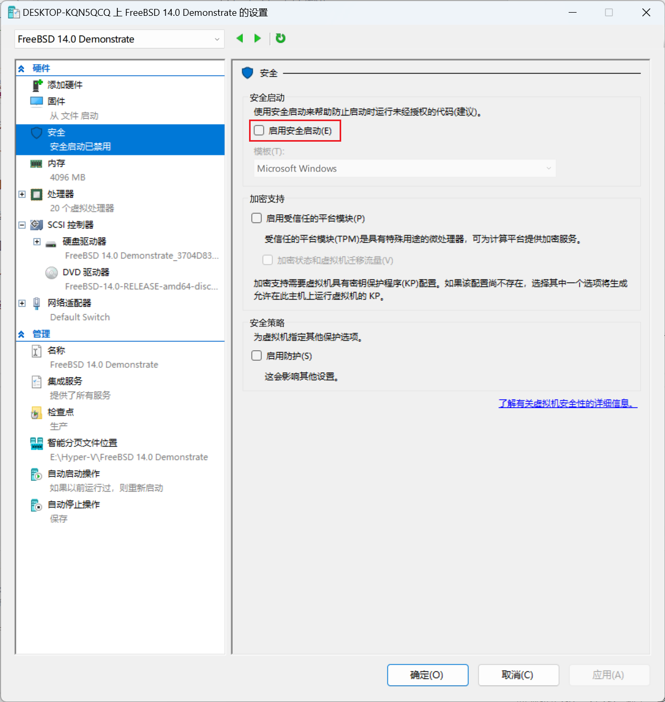
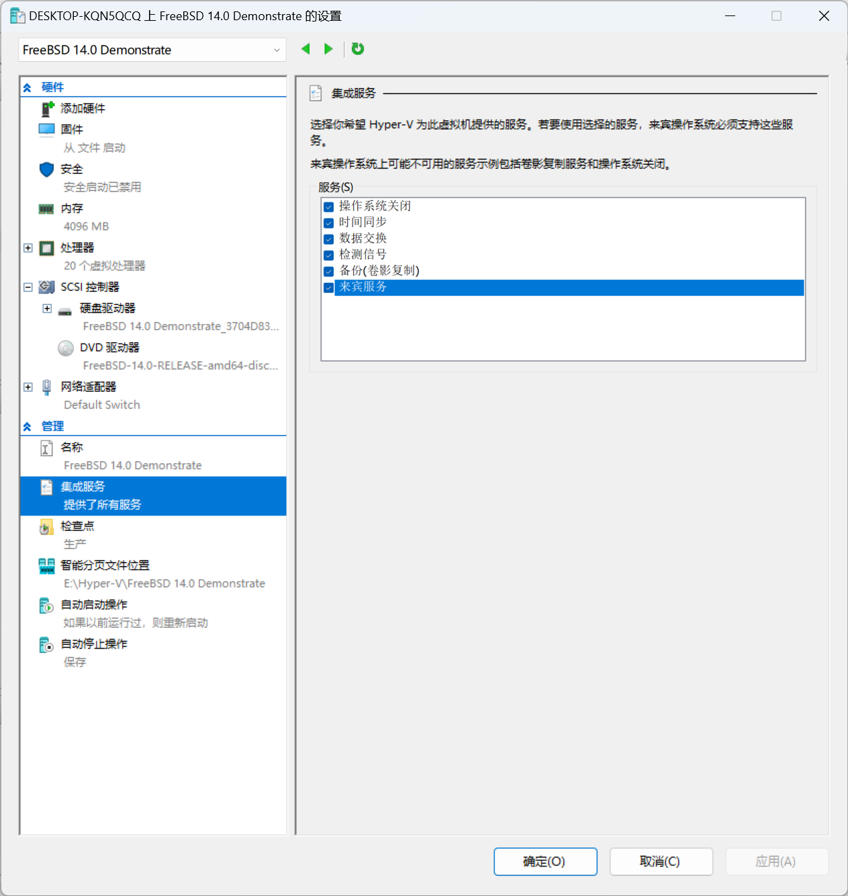
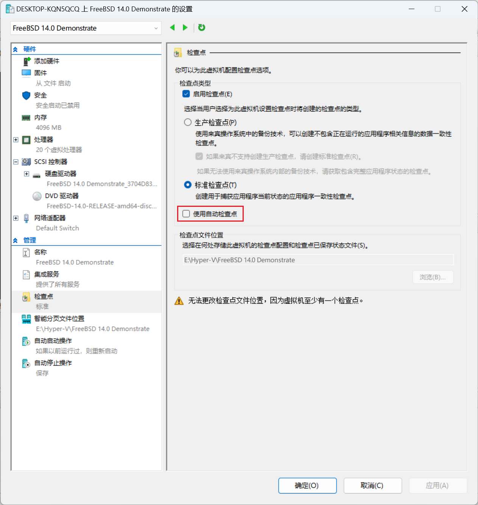

# 第 4 节  在虚拟机中安装 FreeBSD

在各种虚拟机中安装 FreeBSD 的流程相同。这里仅介绍新建虚拟机的选项和安装后的配置。

## 总体建议

建议都使用 UEFI，开机速度更快，终端更大更好看。

## 在 VMware Workstation Pro 中安装 FreeBSD

使用的 VMware Workstation Pro 版本为 17.5.0。

VMware Workstation Pro 的下载、安装和使用不在本教程讨论范围内，请自行学习。

对于 VMware Workstation Player，具体操作相同。

### VMware 虚拟机设置

创建新的虚拟机，一路到选择安装来源。这里要选择稍后安装操作系统。因为 VMware Workstation Pro 无法正确识别 FreeBSD 的版本。



在下一步的系统选择中选择正确的版本。



设置硬盘大小，默认的 20G 对基本系统，甚至再加一个大型桌面来说都绰绰有余，但如果你想要安装大量其他程序，则要考虑加大硬盘。作为参考，在默认开启 lz4 压缩的情况下，基本系统占用不到 600M，基本系统加完整的 xorg、kde5、sddm 占用不到 6G。这是对系统内部而言，实际虚拟硬盘大小会更大一些。个人一般会分配 40G 以上。

默认的 256M 内存也显得 VMware Workstation Pro 很傻。虽然确实能运行起来，但也仅限于此。对 ZFS 来说也显得太小了（不过真的能跑。这也间接证明了 ZFS 实际上并不刚需大内存）。建议至少分配 1G，如果你想运行桌面建议分配 4G 以上。

### VMware 增强工具安装与使用

如果安装桌面

```shellsession
root@freebsd:~ # pkg install open-vm-tools xf86-input-vmmouse xf86-video-vmware
```

如果不安装桌面

```shellsession
root@freebsd:~ # pkg install open-vm-tools-nox11
```

安装后重启

#### VMware 共享文件夹配置

安装增强工具后，在 VMware Workstation Pro 中添加一个共享文件夹，例如 `share`。同时执行

```shellsession
root@freebsd:~ # sysrc kld_list+="fusefs"
kld_list:  -> fusefs
root@freebsd:~ # kldload fusefs
```

查看当前启用的共享文件夹：

```shellsession
alex11@freebsd:~ $ vmware-hgfsclient
share
```

挂载共享文件夹：

```shellsession
root@freebsd:~ # mkdir /mnt/vmware-share
root@freebsd:~ # vmhgfs-fuse .host:/share /mnt/vmware-share
```

即将共享文件夹 `share` 挂载到了 `/mnt/vmware-share/`

挂载所有共享文件夹：

```shellsession
root@freebsd:~ # mkdir /mnt/vmware-share
root@freebsd:~ # vmhgfs-fuse /mnt/vmware-share
```

即将所有共享文件夹挂载到了 `/mnt/vmware-share`，每个共享文件夹有一个子目录。

查看挂载的共享文件夹：

```shellsession
alex11@freebsd:~ # mount
...
vmhgfs-fuse on /mnt/vmware-share (fusefs)
```

卸载共享文件夹：

```shellsession
root@freebsd:~ # umount /mnt/vmware-share
```

自动挂载共享文件夹：

`root` 编辑 `/etc/fstab`，添加以下内容：

```text
.host:/share  /mnt/vmware-share  fusefs  rw,late,mountprog=/usr/local/bin/vmhgfs-fuse  0  0
```

自动挂载全部共享文件夹：

`root` 编辑 `/etc/fstab`，添加：

```text
.host:/  /mnt/vmware-share  fusefs  rw,late,mountprog=/usr/local/bin/vmhgfs-fuse  0  0
```

使用 `mount -al` 检查配置是否正确。

::: warning 注意
由于启动过程中加载 `/etc/rc.conf` 中的 `kld_list` 项的时间晚于 `/etc/fstab` 中无 `late` 选项的文件系统的挂载时间，如果没有在加 `/etc/fstab` 条目中加 `late`，则必须在 `/boot/loader.conf` 中写入 `fusefs_load="YES"`，否则在没有加载 `fusefs.ko` 的时候尝试挂载共享文件夹会失败导致系统进入单用户模式。如果已经进入了单用户模式，可以回车进入命令行，执行 `kldload fusefs` 加载内核模块后用 `exit` 退出，FreeBSD 会继续尝试多用户启动。之后修改 `/etc/fstab` 或 `/boot/loader.conf` 即可。
:::

::: info 提示
`fstab` 项目中的 `rw` 选项并不一定保证共享文件夹一定可以写入。如果在 VMware 的共享文件夹设置中选择了只读，那么同样是无法写入的。如果改成 `ro`，则无论 VMware 的设置如何，都无法写入。`rw` 或 `ro` 是必须的，不能删掉。
:::

#### VMware 桌面大小调整与鼠标集成

::: info 注意
只有启动桌面的情况下才能实现桌面大小自动调整和鼠标集成，命令行无法实现。
:::

安装增强工具后无需配置即可实现桌面大小自动调整。

实现鼠标集成：

生成 Xorg 配置文件：

```shellsession
root@freebsd:~ # Xorg -configure
...
To test the server, run 'X -config /root/xorg.conf.new'
...
root@freebsd:~ # mv /root/xorg.conf.new /etc/X11/xorg.conf
```

::: tip 提示
如果出现

```text
(EE) Cannot establish any listening sockets - Make sure an X server isn't already running(EE)
```

的错误且没有生成 `/root/xorg.conf.new` ，请禁用所有桌面管理器服务如 `gdm` `sddm` 后重启系统，再次执行上面的命令。
:::

`root` 编辑 `/etc/X11/xorg.conf`，修改以下两个部分：

```text
...

Section "ServerLayout"
        Identifier     "X.org Configured"
        Screen          0  "Screen0" 0 0
        InputDevice    "Mouse0" "CorePointer"
        InputDevice    "Keyboard0" "CoreKeyboard"
        Option         "AutoAddDevices" "Off"  # 添加此行
EndSection

...

Section "InputDevice"
      Identifier  "Mouse0"
      Driver      "vmmouse"  # 修改 mouse 为 vmmouse
      Option      "Protocol" "auto"
      Option      "Device" "/dev/sysmouse"
      Option      "ZAxisMapping" "4 5 6 7"
EndSection

...
```

### VMware 中解决时间错误的问题

由于 VMware Workstation Pro 将主机系统时间设为虚拟机硬件时间且无法更改，故 FreeBSD 中时间晚 8 小时的问题只能在 FreeBSD 内部解决。

#### 方法一：硬件时间视为本地时间

创建 `/etc/wall_cmos_clock`：

```shellsession
root@freebsd:~ # touch /etc/wall_cmos_clock
```

之后重启。

#### 方法二：使用增强工具同步时间

安装增强工具后，在 `虚拟机设置` -> `选项` -> `VMware Tools` -> `VMware Tools 功能` 选中 `将客户机时间与主机同步`。



## 在 VirtualBox 中安装 FreeBSD

使用的 VirtualBox 版本为 7.0.14。

VirtualBox 虚拟机的下载、安装和使用不在本文讨论范围内，请自行学习。

### VirtualBox 虚拟机设置

类型选择 `BSD`，版本选择 `FreeBSD (64-bit)` 即可。如果你在虚拟机名称输入 `FreeBSD`，VirtualBox 还会帮你自动选择 :)



### VirtualBox 增强工具安装与使用

如果安装桌面：

```shellsession
root@freebsd:~ # pkg install virtualbox-ose-additions
```

如果不安装桌面：

```shellsession
root@freebsd:~ # pkg install virtualbox-ose-additions-nox11
```

启动服务：

```shellsession
root@freebsd:~ # sysrc vboxguest_enable="YES"
vboxguest_enable:  -> YES
root@freebsd:~ # sysrc vboxservices_enable="YES"
vboxservices_enable:  -> YES
```

之后重启。

#### VirtualBox 共享文件夹配置

在 VirtualBox 中新建共享文件夹，例如名称为 `share`。

::: note
共享文件夹的自动挂载似乎不起作用，所以不用设置挂载点和勾选自动挂载。
:::

读写挂载（共享文件夹设置不能勾选只读挂载）：

```shellsession
root@freebsd:~ # mkdir /mnt/virtualbox-share
root@freebsd:~ # mount_vboxvfs -w share /mnt/virtualbox-share
```

只读挂载：

```shellsession
root@freebsd:~ # mkdir /mnt/virtualbox-share
root@freebsd:~ # mount_vboxvfs -r share /mnt/virtualbox-share
```

卸载：

```shellsession
root@freebsd:~ # umount /mnt/virtualbox-share
```

自动挂载：

`root` 编辑 `/etc/fstab`，添加以下内容：

```text
share  /mnt/virtualbox-share  vboxvfs  rw  0  0
```

::: info 注意
VirtualBox 的共享文件夹似乎有一个 bug：在 FreeBSD 中修改（包括创建）的文件无法删除，在 FreeBSD 下提示 `Text file busy`，在 Windows 下提示 `操作无法完成，因为文件已在 VirtualBox Virtual Machine 中打开。` 必须重启虚拟机才能解除。没有经过 FreeBSD 编辑的文件则不会触发 bug，可以直接删除。
:::

### 解决 UEFI 环境下无法正常关机的问题

编辑 `/etc/sysctl.conf`，添加一行 `hw.efi.poweroff=0`。强制关机后重启即可解决。

### VirtualBox 中解决时间错误的问题

在虚拟机设置 `系统` 中选中 `扩展特性` -> `硬件时钟使用国际标准时间(UTC)`。或按 VMware 中将硬件时间视为本地时间设置。



## 在 Hyper-V 中安装 FreeBSD

Hyper-V 虚拟机不支持共享文件夹，文件拖放，共享剪贴板，调整分辨率等。不建议新手使用。或者可以使用远程桌面。

### Hyper-V 虚拟机代数建议

只建议使用 Gen 2。Gen 1 会在启动 Xorg 之后卡死。并且 FreeBSD 13 在 Gen 1 中不支持鼠标自动切换。当然用远程桌面的话也可以用 Gen 1。~~有 UEFI 谁还会用 Legacy 呢？~~

### Hyper-V 虚拟机与 FreeBSD 版本

FreeBSD 13.2 在 Hyper-V 中不能使用鼠标，FreeBSD 13.3 和 14 正常。

### Hyper-V 虚拟机设置

必须在 `设置` -> `安全` 中禁用安全启动。



可以在 `设置` -> `集成服务` 中勾选 `来宾服务`。



可以在 `设置` -> `检查点` 中取消勾选 `使用自动检查点`，否则每次开机都会自动创建检查点，一般是没有必要的。


