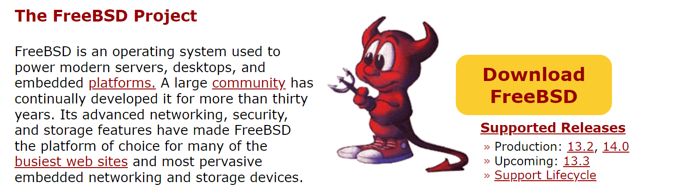
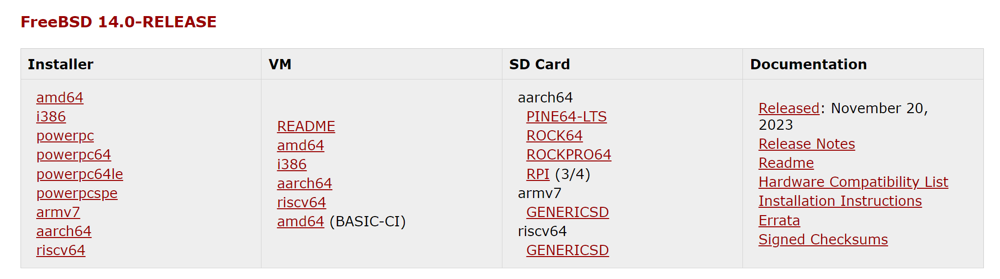
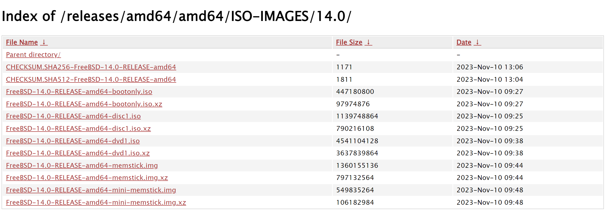

# 第 1 节  我该选择哪个镜像文件？

## 版本名称和镜像类型说明

FreeBSD 主要分为 `RELEASE` `STABLE` `CURRENT`，有大版本号和小版本号。

`CURRENT` 是当前开发的最前沿，是最新也是最不稳定的版本。当开发到一定阶段，当前的 `CURRENT` 版本号就会进入 `STABLE`，同时 `CURRENT` 版本加一。例如，2024/2/1 的 `CURRENT` 版本号为 15，当 15 进入 `STABLE` 时，`CURRENT` 就会变成 16。一般小版本号均为 0。

`STABLE` 并不像字面意义上一样稳定。他是每个大版本号（`CURRENT` 以外）开发的最前沿。当 `STABLE` 开发到一定阶段后就会逐渐进入 `RELEASE`。`STABLE` 小版本号是其所在大版本分支的最新 `RELEASE` 的小版本号或加一。一般我们不关心 `CURRENT` 和 `STABLE` 的小版本号，只需理解 `CURRENT` 是一切开发的最前沿，`STABLE` 是每个大版本号分支的最前沿。

`RELEASE` 是 `STABLE` 稳定得到的分支。一般只会修复 BUG，而不会添加新的功能或特性。有固定的大小版本号。修复 BUG 得到的新版本用 `-pX` 表示。例如 `14.0-RELEASE-p4`。一般建议使用此版本。

注：官网只提供最初的 `RELEASE` 版本，即后面不带 `-pX`。想要更新的版本需要自行升级或构建。

在 FreeBSD 官网主界面 [https://www.freebsd.org/](https://www.freebsd.org/) 会列出当前的版本状态。例如：

可以看到右面列出的 `Production` 版本。这就是当前稳定的支持版本，即 `13.2-RELEASE` 和 `14.0-RELEASE`。同时 `Upcoming` 表示新的 `RELEASE` 分支即将从 `STABLE` 分支产生，即 `13.3-RELEASE` 即将从 `13-STABLE` 产生 。

点击 `Download FreeBSD` 就可以进入下载页面。

一般我们只需要 `amd64` 架构。点击后可跳转到仓库。

可以看到有这几种版本（`xz` 表示压缩过的文件）：

| 名称 | 解释 |
| --- | --- |
| `bootonly.iso` | 仅启动。安装 FreeBSD 需要现从网络下载。新手不推荐。 |
| `disc1.iso` | 在 `bootonly` 的基础上包含了数个用于安装的压缩包文件。推荐使用。 |
| `dvd1.iso` | 在 `disc1` 的基础上多包含了几个用于安装的压缩包文件（调试部分）和很多软件包，可以挂载当做离线源使用。一般不必要。 |
| `memstick.img` | 类似 `disc1`，包含了用于安装的压缩包文件。应该用于 U 盘的刻录。 |
| `mini-memstick.img` | 类似 `bootonly.iso`，不包含安装所需文件。应该用于 U 盘的刻录。 |

简而言之，如果你要用虚拟机安装 FreeBSD，推荐选择 `disc1.iso`。如果想在实体机上利用 U 盘安装 FreeBSD，则应选择 `memstick.img`。如果你想刻录光盘，推荐选择 `dvd1.iso`（因为 `disc1.iso` 比较小浪费了光盘的空间）。如果使用 Ventoy 需要小心，有可能出现不兼容或者硬件识别错误的问题。

选择好自己需要的镜像文件进行下载。如果速度慢的话可以从 [USTC](https://mirrors.ustc.edu.cn/) 等镜像源进行下载。具体做法是把官方仓库网址的 `download.freebsd.org` 替换为 `mirrors.ustc.edu.cn/freebsd`。**注：USTC 等镜像源只有 `release` 源，没有 `snapshot` 源。即只有官方仓库 `https://download.freebsd.org/releases/` 之下的内容。** 或者也可以尝试用迅雷下载。

## 13 与 14 的区别

- 14 将 `root` 用户的 shell 由 `csh` 改为了 `sh`，与一般用户统一。
- 14 将原有的 sendmail 邮件服务改为了 Dragonfly Mail Agent。
- 14 将默认的家目录位置由 `/usr/home/` 改为了 `/home/`，并取消了 `/home/` -> `/usr/home/` 的链接。
- 14 的网络时间同步服务由 ntpd 提供，而不是 ntpdate。
- 以及很多一般性升级

总体上来说建议使用 14
