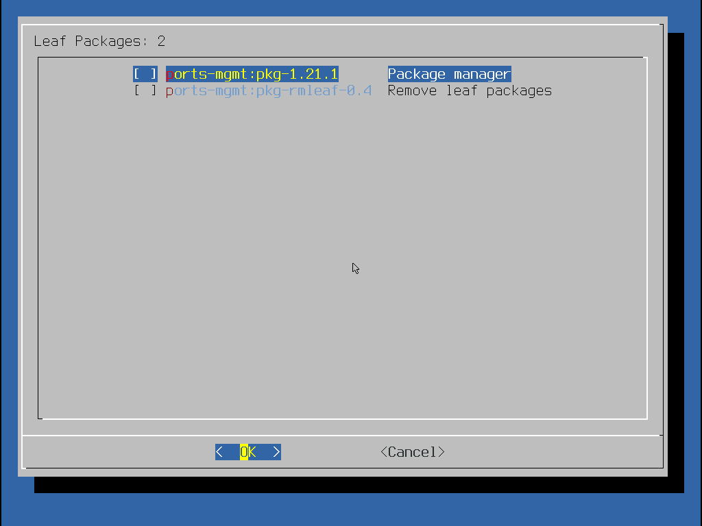

# 第 2 节  pkg

## 什么是 `pkg`

`pkg` 是 FreeBSD 自带的[软件包管理工具](404)。通过 `pkg` 可以安装、删除第三方软件。

## pkg 的安装

在刚刚安装好的 FreeBSD 系统中，并不带有 `pkg` 这个软件，而是判断 `pkg` 是否存在并能下载完整的 `pkg` 的程序。因为实际上 `pkg` 本身也可以视作 “第三方软件包”。这个程序也叫 “pkg”，执行这个命令会看到他的输出：

```shellsession
root@freebsd:~ $ pkg
The package management tool is not yet installed on your system.
Do you want to fetch and install it now? [y/N]
```

这个 `pkg` 会询问是否安装真正的 `pkg`。输入 “y”，开始下载安装。

::: warning 注意
必须用 `root` 执行 `pkg` 命令，否则会提示：

```shellsession
alex11@freebsd:~ $ pkg
The package management tool is not yet installed on your system.
Do you want to fetch and install it now? [y/N]: y
Bootstrapping pkg from pkg+http://pkg.FreeBSD.org/FreeBSD:14:amd64/quarterly, please wait...
Verifying signature with trusted certificate pkg.freebsd.org.2013102301... done
pkg: failed to extract pkg-static: Failed to create dir '/usr/local/sbin'
```

实际上只要想安装、卸载软件包或更新 `pkg` 的数据库，都需要以 `root` 身份执行。一些查询命令比如 `pkg search` 则不需要。这与 Linux 上的软件包管理器类似。
:::

```shellsession
root@freebsd:~ # pkg
The package management tool is not yet installed on your system.
Do you want to fetch and install it now? [y/N]: y
Bootstrapping pkg from pkg+http://pkg.FreeBSD.org/FreeBSD:14:amd64/quarterly, please wait...
Verifying signature with trusted certificate pkg.freebsd.org.2013102301... done
Installing pkg-1.21.1...
Extracting pkg-1.21.1: 100%
pkg: not enough arguments
Usage: pkg [-v] [-d] [-l] [-N] [-j <jail name or id>|-c <chroot path>|-r <rootdir>] [-C <configuration file>] [-R <repo config dir>] [-o var=value] [-4|-6] <command> [<args>]

For more information on available commands and options see 'pkg help'.
```

::: tip 提示
安装好 `pkg` 后会自动把这次执行的参数传给 `pkg`。比如，如果你在第一次直接执行 `pkg install git`，则会在安装好 `pkg` 后直接执行这个命令，安装 `git` 软件包。
:::

## `pkg` 的使用

### 更新 `pkg` 数据库、

以 `root` 执行 `pkg update`，可以更新 `pkg` 的数据库。虽然这个命令一般会在安装软件包之前自动执行，但还是建议首先手动执行一遍。

```shellsession
root@freebsd:~ # pkg update
Updating FreeBSD repository catalogue...
Fetching meta.conf: 100%    178 B   0.2kB/s    00:01
Fetching data.pkg: 100%    7 MiB  75.7kB/s    01:36
Processing entries: 100%
FreeBSD repository update completed. 34054 packages processed.
All repositories are up to date.
```

### 搜索软件包

`pkg search` 用于搜索软件。这个命令不需要以 `root` 身份执行。

例如，想搜索 `git` 软件包：

```shellsession
alex11@freebsd:~ $ pkg search git
R-cran-git2r-0.27.1_4          Provides Access to Git Repositories
R-cran-gitcreds-0.1.2_1        Query 'git' Credentials from 'R'
# 此处省略若干行
uwsgitop-0.10_1                uWSGI top-like app
xtgyoretsu-git20140822         Extended ncurses version of "Renshu-cho gyoretsu"
```

::: tip 提示
如果搜索得到的内容过多，超过了终端范围，可以用 `more` 工具。具体做法如下：

```shellsession
alex11@freebsd:~ $ pkg search git | more
```

其中，`|` 是回车上方那个键，按住 `Shift` 输入，叫做管道符。这个命令的实际含义是，将 `pkg` 命令的输出传递给 `more` 命令处理。

此时，最后一行应该出现类似

```shellsession
--More--(byte 2160)
```

用上下键即可浏览，`PgUp` 和 `PgDn` 可以快速翻页。注意，翻页到最后继续按下键会直接退出。所以你可能要注意 `--More--(END)` 的提示。如果你不想自动退出，可以把 `more` 换成 `less`。`less` 会在最后一行显示一个冒号。按 `q` 可以退出 `more` 或 `less`。
:::

### 安装软件包

使用 `pkg install` 命令可以安装软件包。要以 `root` 身份执行。例如，如果想要安装 `pkg-rmleaf` 这个软件包：

```shellsession
root@freebsd:~ # pkg install pkg-rmleaf
Updating FreeBSD repository catalogue...
FreeBSD repository is up to date.
All repositories are up to date.
The following 1 package(s) will be affected (of 0 checked):

New packages to be INSTALLED:
        pkg-rmleaf: 0.4

Number of packages to be installed: 1

2 KiB to be downloaded.

Proceed with this action? [y/N]: y
[1/1] Fetching pkg-rmleaf-0.4.pkg: 100%    2 KiB   2.5kB/s    00:01
Checking integrity... done (0 conflicting)
[1/1] Installing pkg-rmleaf-0.4...
[1/1] Extracting pkg-rmleaf-0.4: 100%
```

### 删除软件包

`pkg delete` 命令可以删除软件包。要以 `root` 身份执行。例如：要删除 `pkg-rmleaf` 软件包：

```shellsession
root@freebsd:~ # pkg delete pkg-rmleaf
Checking integrity... done (0 conflicting)
Deinstallation has been requested for the following 1 packages (of 0 packages in the universe):

Installed packages to be REMOVED:
        pkg-rmleaf: 0.4

Number of packages to be removed: 1

Proceed with deinstalling packages? [y/N]: y
[1/1] Deinstalling pkg-rmleaf-0.4...
[1/1] Deleting files for pkg-rmleaf-0.4: 100%
```

::: important 知识
软件包之间有 “依赖关系”。意思是，软件包 A 必须依赖软件包 B 才能正常运行。而软件包 B 又可能依赖软件包 C。因此，如果想安装软件包 A，则会自动把软件包 B 和软件包 C 一起安装。此时如果你想移除软件包 C，由于这时软件包 AB 都无法正常运行，所以会把他们一起移除以免发生意料之外的错误。因此在移除软件包时要注意看一下提示，哪些包会被移除，以免不小心移除了需要的包。
:::

#### 使用 `pkg-rmleaf` 删除软件包

因为要尽量避免破坏我们刚刚提到的依赖关系，前人写成了一个用于删除软件包的脚本，~~就是我们刚刚装了又删的~~ `pkg-rmleaf`。

在用 `pkg` 安装 `pkg-rmleaf` （你已经学会了，对吧？）后，以 `root` 身份执行 `pkg-rmleaf`。在统计 “叶软件包”（也就是不被任何软件包依赖的软件包）后，会弹出一个窗口。



这个窗口类似安装时的界面，事实上也是同一个工具绘制的，因此操作也差不多。使用上下键移动光标，空格键选中你想移除的软件包，选中 `OK` 并回车，就会删除选中的软件包。之后脚本会统计删除这些软件包后多出来的 “叶软件包”（也就是说，这些软件包之前只被被删除的软件包依赖，把这些软件包删除后就没有任何软件包依赖他们了），这时可以从中继续选择要删除的软件包，层层递进直到没有任何新的 “叶软件包”。这种删除方式最大程度避免了依赖导致的误删除。

::: warning 注意：给 FreeBSD 15 使用者
在 FreeBSD 15 中，这个脚本不起作用，因为脚本中使用的 `dialog` 在 FreeBSD 15 中被完全替换成了 `bsddialog`。解决方法有：

- 手动编译 FreeBSD 15，在编译时使用选项 `WITH_DIALOG`
- 编辑 `/usr/local/sbin/pkg-rmleaf`，把第 34 行 `FmtDialog="dialog --checklist \"Leaf Packages: %s\" $rows $cols $height %s"` 改为 `FmtDialog="bsddialog --output-separator \" \" --checklist \"Leaf Packages: %s\" $rows $cols $height %s"`

:::

### 删除自动安装的软件包

在安装有依赖的软件包时会把依赖一并安装，此时如果只删除主动安装的软件包，这些依赖并不会被移除，造成残留。可以用 `root` 执行 `pkg autoremove` 命令，把这些自动安装的，现在不被任何软件包依赖的软件包删除。这个操作不会删除主动安装的软件包。例如，在安装软件包 `python39` 时，会自动安装 `gettext-runtime` `indexinfo` `libffi` `mpdecimal` `readline` 这些软件包。在删除 `python39` 后，用 `pkg autoremove` 可以把他们都删除。

```shellsession
root@freebsd:~ # pkg autoremove
Checking integrity... done (0 conflicting)
Deinstallation has been requested for the following 5 packages:

Installed packages to be REMOVED:
 gettext-runtime: 0.22.5
 indexinfo: 0.3.1
 libffi: 3.4.4_1
 mpdecimal: 4.0.0
 readline: 8.2.10

Number of packages to be removed: 5

The operation will free 4 MiB.

Proceed with deinstalling packages? [y/N]: y
[1/5] Deinstalling libffi-3.4.4_1...
[1/5] Deleting files for libffi-3.4.4_1: 100%
[2/5] Deinstalling readline-8.2.10...
[2/5] Deleting files for readline-8.2.10: 100%
[3/5] Deinstalling gettext-runtime-0.22.5...
[3/5] Deleting files for gettext-runtime-0.22.5: 100%
[4/5] Deinstalling indexinfo-0.3.1...
[4/5] Deleting files for indexinfo-0.3.1: 100%
[5/5] Deinstalling mpdecimal-4.0.0...
[5/5] Deleting files for mpdecimal-4.0.0: 100%
```

如果你主动安装了某个软件包，则那个软件包（和他的依赖）不会被删除：

```shellsession
root@freebsd:~ # pkg install gettext-runtime
# 此处省略输出
root@freebsd:~ # pkg install python39
# 此处省略输出
root@freebsd:~ # pkg delete python39
# 此处省略输出
root@freebsd:~ # pkg autoremove
Checking integrity... done (0 conflicting)
Deinstallation has been requested for the following 3 packages:

Installed packages to be REMOVED:
 libffi: 3.4.4_1
 mpdecimal: 4.0.0
 readline: 8.2.10

Number of packages to be removed: 3

The operation will free 3 MiB.

Proceed with deinstalling packages? [y/N]: y
[1/3] Deinstalling mpdecimal-4.0.0...
[1/3] Deleting files for mpdecimal-4.0.0: 100%
[2/3] Deinstalling libffi-3.4.4_1...
[2/3] Deleting files for libffi-3.4.4_1: 100%
[3/3] Deinstalling readline-8.2.10...
[3/3] Deleting files for readline-8.2.10: 100%
# gettext-runtime 因为是主动安装的所以没有被移除。
# indexinfo 则是因为是 gettext-runtime 的依赖也没有被移除。
```

如果你之前没有安装某个软件包，在自动移除时又希望把他标记成主动安装的，可以执行 `pkg set -A 0 packagename`，其中 “packagename” 为软件包名。例如 `pkg set -A 0 gettext-runtime`，把`gettext-runtime` 标记为主动安装。如果想标记回自动，可以用 `pkg set -A 1 packagename`。

::: caution 警告：给 Linux 使用者
重新执行一遍 `pkg install` 并不能把某个包设置为主动安装。这与 `apt` 等包管理器不同。
:::

## 更多信息

可以参考手册 [pkg(7)](https://man.freebsd.org/cgi/man.cgi?query=pkg&sektion=7)（未安装时的 `pkg` 命令）和 [pkg(8)](https://man.freebsd.org/cgi/man.cgi?query=pkg&sektion=8)（真正的 `pkg` 命令）。
